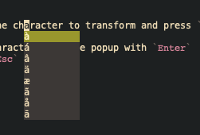

# accent.el

## Overview

accent.el shows a popup with accented characters based on the current letter under the cursor.

Based on the MacOS features for adding accented letters with a long keypress.

## Usage

Position the cursor on the character to transform and press `C-x C-a` (require binding configuration).

- Select the accented character from the popup with `Enter`
- Close the popup with `C-g`

If the character has no accents available, a message will be prompted accordingly.

### Screenshots



Here I'm using `cursor-type: 'block` and `accent-position: 'after`.

## Config

### key binding - RECOMMENDED

Bind a key sequence to open the `accent-menu` accordingly.

``` emacs-lisp
(global-set-key (kbd "C-x C-a") 'accent-menu)
```

`C-x C-a` is a good choice if not already bound. To find your emacs key bindings use

``` emacs-lisp
C-h k key-sequence
```

### accent-position

``` emacs-lisp
;; Use the character after the cursor instead of before
(setq accent-position 'after)
```

---

Copyright (C) 2022 Elia Scotto
